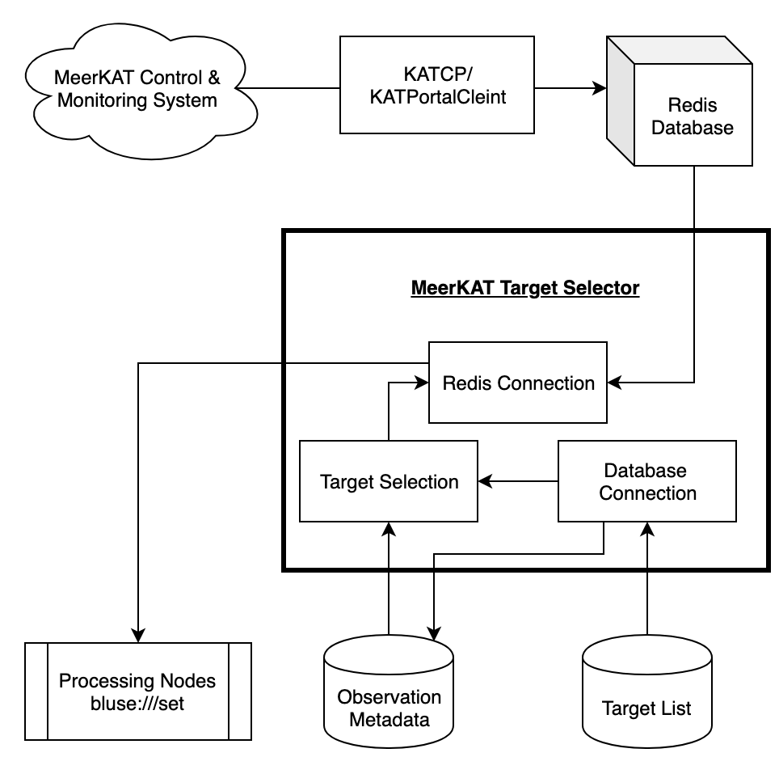
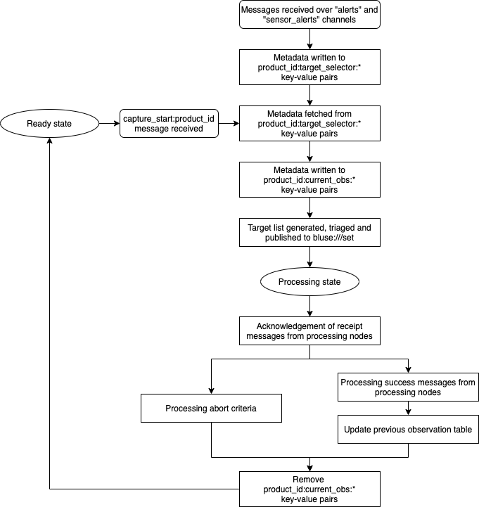
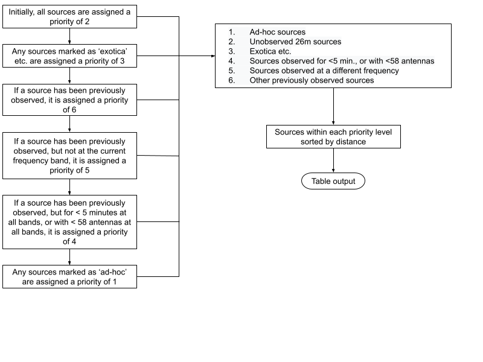

# meerkat-target-selector

One of Breakthrough Listen’s primary objectives is to conduct the most comprehensive radio-frequency search for evidence of intelligent life thus far, observing 1 million nearby stars and other objects [1]. [MeerKAT](https://www.ska.ac.za/gallery/meerkat/), the SKA precursor in South Africa inaugurated in 2018, is one of several instruments crucial to attaining this goal. The data from the array may be tapped off at different processing stages by many users simultaneously through subscription to data streams. This architecture provides a rare opportunity for commensal SETI observing on an array telescope. The Breakthrough Listen program on MeerKAT will be primarily commensal, and 64+ of an eventual 128 servers have already been installed in the on-site data center at the telescope. This project will address an important component of Breakthrough Listen’s program on MeerKAT - identifying the set of targets that can be observed through commensal beamforming during particular primary science observations.




## Installation instructions

### Redis

There are likely many ways to do this, but the simplest way to install Redis is to follow this [link](https://redis.io/topics/quickstart) to their homepage and follow their instructions for your particular distribution.

### Target Selector

```
git clone https://github.com/bart-s-wlodarczyk-sroka/meerkat_target_selector.git
```

```
cd mk_target_selector
```

```
python setup.py install
```

### MySQL database

To install MySQL Server, follow this [link](https://dev.mysql.com/downloads/mysql/) and follow the instructions for your particular distribution.

To set up the database:

```
python scripts/configure_db.py -u your_username
```

This will prompt you for a password which you will need to enter.

## Usage

```
python target_selector_start.py
```
```
[2021-04-07 16:20:23,022 - INFO - target_selector.py:54] Starting Target Selector Client
                      __  __                _  __    _  _____
                     |  \/  | ___  ___ _ __| |/ /   / \|_   _|
                     | |\/| |/ _ \/ _ \ '__| ' /   / _ \ | |
                     | |  | |  __/  __/ |  | . \  / ___ \| |
                     |_|  |_|\___|\___|_|  |_|\_\/_/   \_\_|

          _____                    _     ____       _           _
         |_   _|_ _ _ __ __ _  ___| |_  / ___|  ___| | ___  ___| |_ ___  _ __
           | |/ _` | '__/ _` |/ _ \ __| \___ \ / _ \ |/ _ \/ __| __/ _ \| '__|
           | | (_| | | | (_| |  __/ |_   ___) |  __/ |  __/ (__| || (_) | |
           |_|\__,_|_|  \__, |\___|\__| |____/ \___|_|\___|\___|\__\___/|_|
                        |___/
```

MeerKAT status update messages are published on Redis over the `alerts` and `sensor_alerts` channels. The target selector subscribes to these channels, receiving messages in real-time and sending them to various functions to be acted upon depending on their contents. Relevant data (including the pointing coordinates, observation centre frequency and resource pool) is written to Redis key-value pairs. Upon commencement of observation, pointing coordinate and frequency data is retrieved and used to calculate a list of visible targets; these are queried from MySQL tables containing a sample of 26 million Gaia DR2 sources [2], in addition to smaller samples of exotica [3] and ad-hoc sources. The resulting list of visible targets is compared with another MySQL table containing metadata of previously completed observations, and ordered according to a chosen set of priority criteria. The final triaged list of targets is then sent to the processing nodes. Redis messages received from the backend concerning processing of submitted sources are in turn used to update the table of previous observations, until processing of all the published sources is either successful or aborted.



```
def run(self):
    [...]
    for item in self.p.listen():
        self._message_to_func(item['channel'], self.channel_actions)(item['data'])
```

Incoming messages over the `alerts` and `sensor_alerts` channels are continuously sent to functions, and Redis key-value pairs containing information on the current state of the telescope are continually updated with incoming status messages when the target selector is running. Redis key-value pairs containing metadata for the currently processing observation block, on the other hand, are only updated when the target selector is in the `ready` state, and not in the `processing` state. While the target selector is in the `processing` state, the current observation block Redis keys remain unchanged until confirmation is received from the processing nodes that processing of the current block has either been aborted or concluded successfully. This ensures that in the event of a crash, data for the currently observing block is not lost. The target selector is initially in the `ready` state upon start-up.

### Redis messages

The responses to various types of Redis messages received from MeerKAT are outlined here.

#### `sensor_alerts` -> `product_id:target:radec`

These messages contain the current pointing coordinates (for example, `03:27:04.19, -33:55:26.3`) for a given sub-array, or `product_id`. Upon receipt of such a message, a string containing the parsed coordinates is written to the Redis key `product_id:target_selector:coords`.

```
def _target_query(self, message):
    [...]
    coord_value = "{}, {}".format(coords.ra.deg, coords.dec.deg)
    coord_key = "{}:target_selector:coords".format(product_id)
    write_pair_redis(self.redis_server, coord_key, coord_value)
```
```
[2021-04-07 13:13:40,224 - INFO - mk_redis.py:380] Target coordinate message received: array_1:target:radec, 03:27:04.19, -33:55:26.3
[2021-04-07 13:13:40,285 - INFO - mk_redis.py:385] Wrote [51.76745833333333, -33.92397222222222] to [array_1:target_selector:coords]
```

#### `sensor_alerts` -> `product_id:[...]_channelised_voltage_centre_frequency`

These messages contain the centre frequency in Hz of the current observation (for example, `10000000000`) for a given sub-array. Upon receipt of such a message, a string containing the parsed frequency is written to the Redis key `product_id:target_selector:frequency`.

```
def _frequency(self, message):
    [...]
    frequency_value = get_redis_key(self.redis_server, message)
    frequency_key = "{}:target_selector:frequency".format(product_id)
    write_pair_redis(self.redis_server, frequency_key, frequency_value)    
```
```
[2021-04-07 13:13:40,286 - INFO - mk_redis.py:454] Frequency message received: array_1:subarray_1_streams_wide_antenna_channelised_voltage_centre_frequency
[2021-04-07 13:13:40,286 - INFO - mk_redis.py:461] Wrote [10000000000] to [array_1:target_selector:frequency]
```

#### `sensor_alerts` -> `product_id:[...]_pool_resources`

These messages contain the resource pool (for example, `bluse_1,cbf_1,fbfuse_1,m000,m001`) currently used for observation for a given sub-array. This pool in turn contains information on both the proxies and antennas used for the given observation. Upon receipt of such a message, a string containing the parsed pool is written to the Redis key `product_id:target_selector:pool_resources`.

```
def _pool_resources(self, message):
    [...]
    pool_resources_value = get_redis_key(self.redis_server, message)
    pool_resources_key = "{}:target_selector:pool_resources".format(product_id)
    write_pair_redis(self.redis_server, pool_resources_key, pool_resources_value)    
```
```
[2021-04-07 13:13:40,330 - INFO - mk_redis.py:434] Pool resources message received: array_1:subarray_1_pool_resources
[2021-04-07 13:13:40,331 - INFO - mk_redis.py:441] Wrote [bluse_1,cbf_1,fbfuse_1,m000,m001] to [array_1:target_selector:pool_resources]
```

#### `alerts` -> `capture-start:product_id`

Upon receipt of a `capture-start` message (if the target selector is in the `ready` state) the data stored under the `product_id:target_selector:coords`, `product_id:target_selector:frequency` and `product_id:target_selector:pool_resources` Redis keys is retrieved and written to other Redis keys specific to the current observation (`product_id:current_obs:coords`, `product_id:current_obs:frequency` and `product_id:current_obs:pool_resources`).

```
[2021-04-07 13:13:40,383 - INFO - mk_redis.py:280] Capture start message received: array_1
```
```
def _capture_start(self, message):
    [...]
    def fetch_data(self, product_id):
        [...]
        new_coords = self._get_sensor_value(product_id, "target_selector:coords")
        new_freq = self._get_sensor_value(product_id, "target_selector:frequency")
        new_pool = self._get_sensor_value(product_id, "target_selector:pool_resources")
        [...]
        write_pair_redis(self.redis_server, "{}:current_obs:coords".format(product_id), new_coords)
        write_pair_redis(self.redis_server, "{}:current_obs:frequency".format(product_id), new_freq)
        write_pair_redis(self.redis_server, "{}:current_obs:pool_resources".format(product_id), new_pool)
```

MeerKAT's field of view is calculated from its pointing coordinates and observation frequency, and MySQL tables containing the 26m, ad-hoc and exotica samples are queried for sources contained within.

```
[2021-04-07 13:13:40,384 - INFO - mk_redis.py:182] Fetched array_1:current_obs:coords: 51.76745833333333, -33.92397222222222
[2021-04-07 13:13:40,385 - INFO - mk_redis.py:186] Fetched array_1:current_obs:frequency: 10000000000
[2021-04-07 13:13:40,385 - INFO - mk_redis.py:190] Fetched array_1:current_obs:pool_resources: bluse_1,cbf_1,fbfuse_1,m000,m001
[2021-04-07 13:13:40,386 - INFO - mk_db.py:229] Beam radius at 10.0 GHz (X band): 0.0022207407407407406 radians = 7.634344310232036 arc minutes
[2021-04-07 13:13:40,386 - INFO - mk_db.py:401] Query:
 
                SELECT *
                FROM (
                SELECT ra, decl, source_id, project, dist_c, table_name
                FROM target_list
                UNION ALL
                SELECT ra, decl, source_id, project, dist_c, table_name
                FROM adhoc_list
                UNION ALL
                SELECT ra, decl, source_id, project, dist_c, table_name
                FROM exotica_list
                WHERE (51.614117333667664 < ra  AND ra < 51.920799332998996) AND
                      (-34.05121129405942 < decl AND decl < -33.79673315038502)
                ) as T
                WHERE ACOS( SIN(RADIANS(decl)) * SIN(-0.5920850106328752) + COS(RADIANS(decl)) *
                COS(-0.5920850106328752) * COS(0.9035125933056428 - RADIANS(ra))) < 0.0022207407407407406;   
```

Resulting sources are subsequently triaged according to set criteria. Sources are given a priority value (where a lower value indicates a higher importance), with all sources initially assigned a priority of 2.

Sources marked as 'exotica' are assigned a priority of 3; all sources are then compared against the table of previous observations. If a source has been previously observed, it is assigned a priority of 6. If a source has been previously observed, but at a different frequency band, it is assigned a priority of 5, and if a source has been previously observed, but either with less than 58 antennas or for a total of less than 5 minutes, it is assigned a priority of 4. Finally, sources marked as 'ad-hoc' are assigned a priority of 1. The list of targets is then sorted in order of increasing priority and distance, parsed as a string and written to the Redis key `product_id:current_obs:target_list`.



```
targets = self.engine.select_targets
               (np.deg2rad(coords_ra),
                np.deg2rad(coords_dec),
                current_freq=self._get_sensor_value(product_id, "current_obs:frequency"),
                beam_rad=self._beam_radius(self._get_sensor_value(product_id, "current_obs:frequency")))
[...]
targets_table = pd.DataFrame.to_csv(targets)
[...]
write_pair_redis(self.redis_server, "{}:current_obs:target_list".format(product_id), targets_table)
```

The current timestamp is written to the Redis key `product_id:current_obs:obs_start_time` (indicating the observation start time), the target list is published to `bluse:///set`, and the target selector state is set to `processing`. 

```
    pulled_targets = StringIO(self._get_sensor_value(product_id, "current_obs:target_list"))
    pulled_coords = self._get_sensor_value(product_id, "current_obs:coords")
    pulled_freq = self.engine.freq_format(self._get_sensor_value(product_id, "current_obs:frequency"))
    targets_to_publish = pd.read_csv(pulled_targets, sep=",", index_col=0)
    [...]
    obs_start_time = datetime.now()
    write_pair_redis(self.redis_server, "{}:current_obs:obs_start_time".format(product_id), str(obs_start_time))
    [...]
    self._publish_targets(targets_to_publish, product_id, sub_arr_id)

def _publish_targets(self, targets, product_id, channel, columns, sub_arr_id, sensor_name='targets'):
    [...]
    write_pair_redis(self.redis_server, key, json.dumps(targ_dict))
    publish(self.redis_server, channel, key)
    [...]
    pStatus.proc_status = "processing"
```
```
[2021-04-07 13:13:44,718 - INFO - mk_redis.py:292] Targets to publish for 51.76745833333333, -33.92397222222222 at 10.0 GHz:

    index       ra     decl            source_id project    dist_c   table_name  priority
0       0  51.7978 -33.8153  5053625616177975040  Fornax   142.425  26m_sources         2
1       1  51.7594 -33.8872  5053624207428706560  Fornax   272.543  26m_sources         2
2       2  51.7552 -33.9211  5053624035630059904  Fornax   291.965  26m_sources         2
3       3  51.7664 -33.8293  5053625478739023616  Fornax   303.679  26m_sources         2
4       4  51.8664 -33.9631  5053620217402371584  Fornax   306.265  26m_sources         2
5       5  51.9055 -33.9731  5053619981180928384  Fornax   374.880  26m_sources         2
6       6  51.6755 -33.8736  5053249858078917248  Fornax   382.511  26m_sources         2
7       7  51.7595 -33.9513  5053248414969953792  Fornax   390.904  26m_sources         2
8       8  51.6809 -33.8775  5053249858078916992  Fornax   479.874  26m_sources         2
9       9  51.7280 -33.8856  5053624928983213056  Fornax   485.308  26m_sources         2
10     10  51.7184 -33.8620  5053625238220858240  Fornax   597.423  26m_sources         2
11     11  51.8003 -33.8465  5053624752887835392  Fornax   660.337  26m_sources         2
12     12  51.6663 -34.0157  5053247968293415168  Fornax   702.241  26m_sources         2
13     13  51.8029 -33.8436  5053624757184516992  Fornax   773.546  26m_sources         2
14     14  51.9150 -33.9501  5053620118619880704  Fornax   799.779  26m_sources         2
15     15  51.8445 -33.8476  5053625989838416768  Fornax   894.224  26m_sources         2
16     16  51.7777 -33.9465  5053623726392417920  Fornax   931.461  26m_sources         2
17     17  51.7434 -33.8593  5053625066422165120  Fornax  1214.930  26m_sources         2
18     18  51.8366 -33.9569  5053620599656220928  Fornax  1341.090  26m_sources         2
19     19  51.8435 -33.9123  5053621286850986752  Fornax  1372.230  26m_sources         2
20     20  51.6841 -33.9343  5053249377042582656  Fornax  1384.220  26m_sources         2
21     21  51.8233 -33.8117  5053627059286985216  Fornax  1649.230  26m_sources         2
22     22  51.6996 -33.9263  5053249480121796736  Fornax  1903.850  26m_sources         2

[2021-04-07 13:13:44,720 - INFO - mk_redis.py:775] Targets published to bluse:///set
[2021-04-07 13:13:44,720 - INFO - mk_redis.py:777] Processing state set to 'processing'
```

While the target selector is in the `processing` state, the `[...]:target_selector:[...]` Redis keys are continually updated with incoming status messages, while the `[...]:current_obs:[...]` Redis keys remain the same until confirmation is received from the processing nodes that processing of the current block has either been aborted or concluded successfully.

#### `alerts` -> `capture-stop:product_id`

Upon receipt of such a message, if there are targets stored under the Redis key `product_id:current_obs:target_list` and the observation end time is not already stored, the current timestamp is written to the Redis key `product_id:current_obs:obs_end_time`.

```
[2021-04-07 13:14:00,966 - INFO - mk_redis.py:309] Capture stop message received: array_1
```
```
def _capture_stop(self, message):
    [...] 
    if "None" not in str(self._get_sensor_value(product_id, "current_obs:target_list"))\
            and "None" in str(self._get_sensor_value(product_id, "current_obs:obs_end_time")):
        [...]
        obs_end_time = datetime.now()
        write_pair_redis(self.redis_server, "{}:current_obs:obs_end_time".format(product_id), str(obs_end_time))
        self.store_metadata(product_id)
```

Values containing data on the antennas and proxies in use (`product_id:current_obs:pool_resources`), the start time  (`product_id:current_obs:obs_start_time`) and end time (`product_id:current_obs:obs_end_time`) of observation, the list of targets (`product_id:current_obs:target_list`) and the frequency of observation (`product_id:current_obs:frequency`) are pulled from their respective Redis keys, and used to update the table of previous observations.

```
def store_metadata(self, product_id):
    [...]
    pool_resources = self._get_sensor_value(product_id, "current_obs:pool_resources")
    antennas = ','.join(re.findall(r'm\d{3}', pool_resources))
    proxies = ','.join(re.findall(r'[a-z A-Z]+_\d', pool_resources))
    start = self._get_sensor_value(product_id, "current_obs:obs_start_time")
    end = self._get_sensor_value(product_id, "current_obs:obs_end_time")
    targets = pd.read_csv(StringIO(self._get_sensor_value(product_id, "current_obs:target_list")), sep=",", index_col=0)
    current_freq = self._get_sensor_value(product_id, "current_obs:frequency")
    bands = self.engine._freqBand(current_freq)
    n_antennas = antennas.count(',') + 1
    file_id = 'filler_file_id'
    self.engine.add_sources_to_db(targets, start, end, proxies, antennas, n_antennas, file_id, bands)
```

#### `sensor_alerts` -> `product_id:acknowledge_source_id_[...]`

These messages indicate the successful receipt & onset of processing of individual sources contained in the currently processing observation block by the processing nodes. Once receipt of the final target in the published list is acknowledged, if the start time of processing is not already stored, the current timestamp is written to the Redis key `product_id:current_obs:proc_start_time`. This is subsequently used to define abort criteria for the total processing time.

```
def _acknowledge(self, message):
    [...]
    if get_redis_key(self.redis_server, "{}:current_obs:proc_start_time".format(product_id)) is None\
            and self.reformat_table(q)['source_id'].iloc[-1].lstrip() in message:
        [...]
        proc_start_time = datetime.now()
        write_pair_redis(self.redis_server, "{}:current_obs:proc_start_time".format(product_id), str(proc_start_time))
```
```
[2021-04-07 13:14:16,490 - INFO - mk_redis.py:529] Receipt of all targets confirmed by processing nodes
```

#### `sensor_alerts` -> `product_id:success_source_id_[...]`

These messages indicate confirmation of the successful completion of processing of individual sources contained in the currently processing observation block by the processing nodes. The MySQL table containing data on previous observations is then updated to reflect this successful processing. The correct entry to update is identified via the `product_id:current_obs:obs_start_time` timestamp, which confirms that the entry is contained within the currently processing block.

```
def _processing_success(self, message):
    [...]
    self.engine.update_obs_status(source_id, 
                                  obs_start_time=str(self.round_time
                                                     (self._get_sensor_value
                                                      (product_id, "current_obs:obs_start_time"))), processed='TRUE')
```

The receipt of such a message for every source in the published list of targets indicates successful processing of all sources. Accordingly, all `[...]:current_obs:[...]` Redis keys are deleted, and the processing state of the target selector is set to `ready`.

```
if number_processed == number_to_process:
    logger.info("Confirmation of successful processing of all sources received from processing nodes")
    self._deconfigure(product_id)
    pStatus.proc_status = "ready"
    logger.info("Processing state set to \'ready\'")
```
```
[2021-04-07 13:14:31,492 - INFO - mk_redis.py:496] Confirmation of successful processing of all sources received from processing nodes
[2021-04-07 13:14:31,515 - INFO - mk_redis.py:256] Removing key: array_1:pointing_0:targets
[2021-04-07 13:14:31,526 - INFO - mk_redis.py:499] Processing state set to 'ready'
```

If the processing time elapsed (calculated from `product_id:current_obs:proc_start_time`) exceeds 10 minutes with over 90% of sources successfully processed, or if the processing time elapsed exceeds both 20 minutes and 2t<sub>obs</sub> - 5 minutes (where t<sub>obs</sub> is the total time of observation), processing is aborted; all `[...]:current_obs:[...]` Redis keys are deleted, and the processing state of the target selector is set to `ready`.

```
if (fraction_processed > 0.9) and (time_elapsed > 600):
    logger.info("Processing time has exceeded 10 minutes, with >90% of targets processed successfully. Aborting")
    self._deconfigure(product_id)
    pStatus.proc_status = "ready"
    logger.info("Processing state set to \'ready\'")
[...]
if (time_elapsed > 1200) and (time_elapsed > (2 * observation_time) - 300):
    logger.info("Processing time has exceeded both 20 and (2t_obs - 5) minutes. Aborting")
    self._deconfigure(product_id)
    pStatus.proc_status = "ready"
    logger.info("Processing state set to \'ready\'")
```

### Redis key-value pairs

A list of the redis key-value pairs generated by the target selector is presented here.

#### `product_id:target_selector:*` 

These keys store the current, up-to-date telescope status and are continually updated regardless of the telescope processing state. All of them are pretty self-explanatory.

* `product_id:target_selector:coords`, i.e. `74.79179, 43.0175`
* `product_id:target_selector:pool_resources`, i.e. `bluse_1,cbf_1,fbfuse_1,m000,m001`
* `product_id:target_selector:frequency`, i.e. `10000000000`

#### `product_id:current_obs:*`

These store the metadata for the currently processing block, and are not changed once the block is published until processing is either completed or aborted.

* `product_id:current_obs:coords`, i.e. `74.79179, 43.0175`
* `product_id:current_obs:pool_resources`, i.e. `bluse_1,cbf_1,fbfuse_1,m000,m001`
* `product_id:current_obs:frequency`, i.e. `10000000000`
* `product_id:current_obs:obs_start_time`, datetime object parsed as string i.e. `2021-03-25 21:40:11.11111`. Currently this is used to calculate t<sub>obs</sub>, as well as in addition to the source_id to identify which sources from the previously observed table to update upon receipt of successful processing messages. The first use case will be obsolete/unnecessary once we have or simulate t<sub>obs</sub> messages from the processing nodes.
* `product_id:current_obs:obs_end_time`, datetime object parsed as string i.e. `2021-03-25 21:40:11.11111`. This is only used to calculate t<sub>obs</sub>, and will thus be unnecessary as above.
* `product_id:current_obs:proc_start_time`, datetime object parsed as string i.e. `2021-03-25 21:40:11.11111`. Set at the moment the processing nodes confirm receipt of the last target in the published block, and used to calculate processing duration for the abort criteria.
* `product_id:current_obs:target_list`, dataframe containing targets in the currently processing block , parsed as a csv-formatted string, i.e. `source_id,ra,dec,dist_c,.../123456789,A,B,C,.../[...]`

There will also need to be two additional key-value pairs (one for the current telescope status, and one for the current observation block) to store the pointing number from the schedule block.

Lastly, there are two more key-value pair formats used, for messages from the processing nodes acknowledging the receipt of targets and successful processing; these of course can be changed to whatever format is required.

* `product_id:acknowledge_source_id_123456789`, value `True`
* `product_id:success_source_id_123456789`, value `True`

## Next steps

Subsequent steps include:

* Further developing sub-array functionality, to test operation of multiple sub-arrays at a time.
* Further developing schedule block functionality, to be able to plan for upcoming observations in real-time.
* In actual operation, the beginning and end of observation will not be indicated by `capture` messages but by `tracking` messages. Once these messages are either simulated or implemented, actions currently undertaken on receipt of `capture` messages will be changed.
* Total useful observation time can only be given by the processing nodes, and not calculated by the target selector. Accordingly, once this observation time is either implemented or simulated, `product_id:current_obs:obs_start_time` will no longer be calculated as before and `product_id:current_obs:obs_end_time` will become obsolete.
* More advanced and comprehensive testing of the functionality in a realistic environment, perhaps testing on-site.
* Adapting the target selector to VLA set-up.

## References

1. Isaacson, Howard, et al. "The Breakthrough Listen search for intelligent life: Target selection of nearby stars and galaxies." https://arxiv.org/pdf/1701.06227.pdf

2. Czech, Daniel, et al. "The Breakthrough Listen Search for Intelligent Life: MeerKAT Target Selection.", in prep.

3. Lacki, Brian C., et al. "One of Everything: The Breakthrough Listen Exotica Catalog." https://arxiv.org/pdf/2006.11304.pdf

4. https://github.com/danielczech/meerkat-backend-interface.git forked from https://github.com/ejmichaud/meerkat-backend-interface

5. Enriquez, J. Emilio, et al. "The Breakthrough Listen search for intelligent life: 1.1–1.9 GHz observations of 692 nearby stars." https://arxiv.org/pdf/1709.03491.pdf

6. SETI and the Square Kilometre Array https://arxiv.org/abs/1412.4867

## Credits

Thank you to [Tyler Cox](https://github.com/tyler-a-cox/meerkat_target_selector) and [Daniel Czech](https://github.com/danielczech/meerkat_target_selector), whose contributions made this work possible.