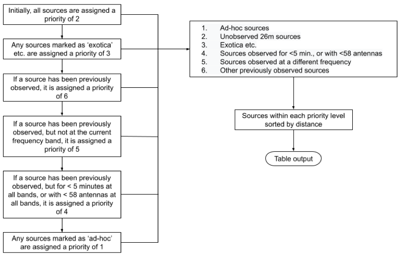

# meerkat-target-selector

One of Breakthrough Listen’s primary objectives is to conduct the most comprehensive radio-frequency search for evidence of intelligent life thus far, observing 1 million nearby stars and other objects [1]. [MeerKAT](https://www.ska.ac.za/gallery/meerkat/), the SKA precursor in South Africa inaugurated in 2018, is one of several instruments crucial to attaining this goal. The data from the array may be tapped off at different processing stages by many users simultaneously through subscription to data streams. This architecture provides a rare opportunity for commensal SETI observing on an array telescope. The Breakthrough Listen program on MeerKAT will be primarily commensal, and 64+ of an eventual 128 servers have already been installed in the on-site data center at the telescope. This project will address an important component of Breakthrough Listen’s program on MeerKAT - identifying the set of targets that can be observed through commensal beamforming during particular primary science observations.


## Installation instructions

### Redis

There are likely many ways to do this, but the simplest way to install Redis is to follow this [link](https://redis.io/topics/quickstart) to their homepage and follow their instructions for your particular distribution.

### Target Selector

```
git clone https://github.com/bart-s-wlodarczyk-sroka/meerkat_target_selector.git
```

```
cd mk_target_selector
```

```
python setup.py install
```

### MySQL database

To install MySQL Server, follow this [link](https://dev.mysql.com/downloads/mysql/) and follow the instructions for your particular distribution.

To set up the database:

```
python scripts/configure_db.py -u your_username
```

This will prompt you for a password which you will need to enter. This downloads the relevant data tables containing the 26m source sample as well as the ad-hoc and exotica samples to a MySQL database, and need only be done once prior to running the target selector.

## Usage

```
python target_selector_start.py
```
```
[2021-04-07 16:20:23,022 - INFO - target_selector.py:54] Starting Target Selector Client
                      __  __                _  __    _  _____
                     |  \/  | ___  ___ _ __| |/ /   / \|_   _|
                     | |\/| |/ _ \/ _ \ '__| ' /   / _ \ | |
                     | |  | |  __/  __/ |  | . \  / ___ \| |
                     |_|  |_|\___|\___|_|  |_|\_\/_/   \_\_|

          _____                    _     ____       _           _
         |_   _|_ _ _ __ __ _  ___| |_  / ___|  ___| | ___  ___| |_ ___  _ __
           | |/ _` | '__/ _` |/ _ \ __| \___ \ / _ \ |/ _ \/ __| __/ _ \| '__|
           | | (_| | | | (_| |  __/ |_   ___) |  __/ |  __/ (__| || (_) | |
           |_|\__,_|_|  \__, |\___|\__| |____/ \___|_|\___|\___|\__\___/|_|
                        |___/
```

MeerKAT status update messages are published on Redis over the `alerts` and `sensor_alerts` channels. The target selector subscribes to these channels, receiving messages in real-time and sending them to various functions to be acted upon depending on their contents. Relevant data (including the pointing coordinates, observation centre frequency and resource pool) is written to Redis key-value pairs. Upon commencement of observation, pointing coordinate and frequency data is retrieved and used to calculate a list of visible targets; these are queried from MySQL tables containing a sample of 26 million Gaia DR2 sources [2], in addition to smaller samples of exotica [3] and ad-hoc sources. The resulting list of visible targets is compared with another MySQL table containing metadata of previously completed observations, and ordered according to a chosen set of priority criteria. 

Taking into account the individual antennas used for a given observation and their respective weightings, along with the time of day at which the observations were performed, the interferometric point spread function (PSF) is simulated to give an approximate shape and size for the synthesized coherent beams, 64 of which can be formed on the field of view simultaneously with current capabilities. Optimisation of the positioning of these 64 beams allows for the targeting of several sources simultaneously with any given beam; parameters set the behaviour of the optimisation to achieve a balance between total number of targeted sources and the sensitivity at which sources are targeted. The final list of target coordinates is then sent to the processing nodes. Redis messages received from the backend concerning processing of submitted sources are in turn used to update the table of previous observations, until processing of all the published sources is either successful or aborted.


```
def run(self):
    [...]
    for item in self.p.listen():
        self._message_to_func(item['channel'], self.channel_actions)(item['data'])
```

Incoming messages over the `alerts` and `sensor_alerts` channels are continuously sent to functions, and Redis key-value pairs containing information on the current state of the telescope are continually updated with incoming status messages when the target selector is running. Redis key-value pairs containing metadata for the currently processing observation block, on the other hand, are only updated when the target selector is in the `ready` state, and not in the `processing` state. While the target selector is in the `processing` state, the current observation block Redis keys remain unchanged until confirmation is received from the processing nodes that processing of the current block has either been aborted or concluded successfully. This ensures that in the event of a crash, data for the currently observing block is not lost. The target selector is initially in the `ready` state upon start-up.

### Redis messages

The responses to various types of Redis messages received from MeerKAT are outlined here.

#### `sensor_alerts` -> `product_id:target:radec`

These messages contain the current pointing coordinates (for example, `03:27:04.19, -33:55:26.3`) for a given sub-array, or `product_id`. Upon receipt of such a message, a string containing the parsed coordinates is written to the Redis key `product_id:new_obs:coords`.

```
def _target_query(self, message):
    [...]
    coord_value = "{}, {}".format(coords.ra.deg, coords.dec.deg)
    coord_key = "{}:new_obs:coords".format(product_id)
    write_pair_redis(self.redis_server, coord_key, coord_value)
```
```
[2021-04-07 13:13:40,224 - INFO - mk_redis.py:380] Target coordinate message received: array_1:target:radec, 03:27:04.19, -33:55:26.3
[2021-04-07 13:13:40,285 - INFO - mk_redis.py:385] Wrote [51.76745833333333, -33.92397222222222] to [array_1:new_obs:coords]
```

#### `sensor_alerts` -> `product_id:[...]_channelised_voltage_centre_frequency`

These messages contain the centre frequency in Hz of the current observation (for example, `10000000000`) for a given sub-array. Upon receipt of such a message, a string containing the parsed frequency is written to the Redis key `product_id:new_obs:frequency`.

```
def _frequency(self, message):
    [...]
    frequency_value = get_redis_key(self.redis_server, message)
    frequency_key = "{}:new_obs:frequency".format(product_id)
    write_pair_redis(self.redis_server, frequency_key, frequency_value)    
```
```
[2021-04-07 13:13:40,286 - INFO - mk_redis.py:454] Frequency message received: array_1:subarray_1_streams_wide_antenna_channelised_voltage_centre_frequency
[2021-04-07 13:13:40,286 - INFO - mk_redis.py:461] Wrote [10000000000] to [array_1:new_obs:frequency]
```

#### `sensor_alerts` -> `product_id:[...]_pool_resources`

These messages contain the resource pool (for example, `bluse_1,cbf_1,fbfuse_1,m000,m001`) currently used for observation for a given sub-array. This pool in turn contains information on both the proxies and antennas used for the given observation. Upon receipt of such a message, a string containing the parsed pool is written to the Redis key `product_id:new_obs:pool_resources`.

```
def _pool_resources(self, message):
    [...]
    pool_resources_value = get_redis_key(self.redis_server, message)
    pool_resources_key = "{}:new_obs:pool_resources".format(product_id)
    write_pair_redis(self.redis_server, pool_resources_key, pool_resources_value)    
```
```
[2021-04-07 13:13:40,330 - INFO - mk_redis.py:434] Pool resources message received: array_1:subarray_1_pool_resources
[2021-04-07 13:13:40,331 - INFO - mk_redis.py:441] Wrote [bluse_1,cbf_1,fbfuse_1,m000,m001] to [array_1:new_obs:pool_resources]
```

#### `alerts` -> `capture-start:product_id`

Upon receipt of a `capture-start` message (if the target selector is in the `ready` state) the data stored under the `product_id:new_obs:coords`, `product_id:new_obs:frequency` and `product_id:new_obs:pool_resources` Redis keys is retrieved and written to other Redis keys specific to the current observation (`product_id:current_obs:coords`, `product_id:current_obs:frequency` and `product_id:current_obs:pool_resources`).

```
[2021-04-07 13:13:40,383 - INFO - mk_redis.py:280] Capture start message received: array_1
```
```
def _capture_start(self, message):
    [...]
    if pStatus.proc_status == "ready":
        self.fetch_data(product_id, mode="current_obs")
```
```
def fetch_data(self, product_id, mode)
    [...]
    new_coords = self._get_sensor_value(product_id, "new_obs:coords")
    new_freq = self._get_sensor_value(product_id, "new_obs:frequency")
    new_pool = self._get_sensor_value(product_id, "new_obs:pool_resources")
    [...]
    if mode == "current_obs":
        write_pair_redis(self.redis_server, "{}:current_obs:coords".format(product_id), new_coords)
        write_pair_redis(self.redis_server, "{}:current_obs:frequency".format(product_id), new_freq)
        write_pair_redis(self.redis_server, "{}:current_obs:pool_resources".format(product_id), new_pool)
```

MeerKAT's field of view is calculated from its pointing coordinates and observation frequency, and MySQL tables containing the 26m, ad-hoc and exotica samples are queried for sources contained within.

```
[2021-04-07 13:13:40,384 - INFO - mk_redis.py:182] Fetched array_1:current_obs:coords: 51.76745833333333, -33.92397222222222
[2021-04-07 13:13:40,385 - INFO - mk_redis.py:186] Fetched array_1:current_obs:frequency: 10000000000
[2021-04-07 13:13:40,385 - INFO - mk_redis.py:190] Fetched array_1:current_obs:pool_resources: bluse_1,cbf_1,fbfuse_1,m000,m001
[2021-04-07 13:13:40,386 - INFO - mk_db.py:229] Beam radius at 10.0 GHz (X band): 0.0022207407407407406 radians = 7.634344310232036 arc minutes
[2021-04-07 13:13:40,386 - INFO - mk_db.py:401] Query:
 
                SELECT *
                FROM (
                SELECT ra, decl, source_id, project, dist_c, table_name
                FROM target_list
                UNION ALL
                SELECT ra, decl, source_id, project, dist_c, table_name
                FROM adhoc_list
                UNION ALL
                SELECT ra, decl, source_id, project, dist_c, table_name
                FROM exotica_list
                WHERE (51.614117333667664 < ra  AND ra < 51.920799332998996) AND
                      (-34.05121129405942 < decl AND decl < -33.79673315038502)
                ) as T
                WHERE ACOS( SIN(RADIANS(decl)) * SIN(-0.5920850106328752) + COS(RADIANS(decl)) *
                COS(-0.5920850106328752) * COS(0.9035125933056428 - RADIANS(ra))) < 0.0022207407407407406;   
```

Resulting sources are subsequently triaged according to set criteria. Sources are given a priority value (where a lower value indicates a higher importance), with all sources initially assigned a priority of 2.

Sources marked as 'exotica' are assigned a priority of 3; all sources are then compared against the table of previous observations. If a source has been previously observed, it is assigned a priority of 6. If a source has been previously observed, but at a different frequency band, it is assigned a priority of 5, and if a source has been previously observed, but either with less than 58 antennas or for a total of less than 5 minutes, it is assigned a priority of 4. Finally, sources marked as 'ad-hoc' are assigned a priority of 1. The list of targets is then sorted in order of increasing priority and distance, parsed as a string and written to the Redis key `product_id:current_obs:target_list`.



```
targets = self.engine.select_targets
               (np.deg2rad(coords_ra),
                np.deg2rad(coords_dec),
                current_freq=self._get_sensor_value(product_id, "current_obs:frequency"),
                beam_rad=self._beam_radius(self._get_sensor_value(product_id, "current_obs:frequency")))
[...]
targets_table = pd.DataFrame.to_csv(targets)
[...]
write_pair_redis(self.redis_server, "{}:current_obs:target_list".format(product_id), targets_table)
```

The current timestamp is written to the Redis key `product_id:current_obs:obs_start_time` (indicating the observation start time) and the list of triaged visible source coordinates is sent to the optimizer. 

```
    pulled_targets = json.loads(self._get_sensor_value(product_id, "current_obs:target_list"))
    [...]
    obs_start_time = datetime.now()
    write_pair_redis(self.redis_server, "{}:current_obs:obs_start_time".format(product_id), str(obs_start_time))
    self._publish_targets(targets_to_publish, product_id, sub_arr_id)
```
```
def _publish_targets(self, targets, product_id, channel, columns=None, sub_arr_id=0, sensor_name='targets'):
    [...]
    self.optimize(product_id, targets)
```

The optimizer calculates the optimal positioning for the 64 coherent beams.

The size and shape of the coherent beam sensitivity response is dependent on the individual antennas used for a given observation, as well as the projection of antenna baselines on the sky in the pointing direction at the time of the observation. The sensitivity gradient is estimated by simulating the beam point spread function (PSF). The resulting beam is often irregular in shape; for ease of calculation, the beams were subsequently estimated by taking contours of the PSF and constructing the largest possible ellipses contained entirely within them [# TODO: CITE MOSAIC STUFF, MAYBE INCLUDE IMAGES].

A coordinate transformation is applied to the field of view such that the elliptical coherent beams become circular. It follows that any two sources separated by a distance of less than 2r in the transformed coordinate frame can be targeted by a single coherent beam; the set of all these intersection points, along with the coordinates for any sources insufficiently close to any others, allows for the solution of the 'maximum coverage problem' - picking the set of circles to cover the largest possible number of targets. This can be further combined with knowledge of the coherent beam sensitivity gradient from the PSF, to select for higher-quality observations. The coordinate frame is then transformed back, and the target and beam coordinates (in their original frame) are written to Redis key-value pairs.

```
def optimize(self, product_id, targets)
    [...]
    obs_time = str(self._get_sensor_value(product_id, "current_obs:obs_start_time"))
    pool_resources = str(self._get_sensor_value(product_id, "current_obs:pool_resources"))
    coordinates = str(self._get_sensor_value(product_id, "current_obs:coords"))
    frequency = str(self._get_sensor_value(product_id, "current_obs:frequency"))
    pointing_ra, pointing_dec = map(float, coordinates.split(", "))
    possible_targets = Target.parse_targets(targets, pointing_ra, pointing_dec, frequency)
    opt = Optimizer(frequency, coordinates, pool_resources, possible_targets, time=obs_time)
    opt.optimize()
    [...]
    write_pair_redis(self.redis_server, "{}:current_obs:beamform_beams".format(product_id), json.dumps(beams))
    [...]
    write_pair_redis(self.redis_server, "{}:current_obs:beamform_targets".format(product_id), json.dumps(targets))
```

The list of beam coordinates is written to Redis key-value pairs for beams remaining to be acknowledged by the processing nodes and subsequently processed. The list of targeted sources is published to `bluse:///set`.

```
    [...]
    beamform_beams = json.loads(self._get_sensor_value(product_id, "current_obs:beamform_beams"))
    [...]
    beamform_targets = json.loads(self._get_sensor_value(product_id, "current_obs:beamform_targets"))
    [...]
    key = '{}:pointing_{}:{}'.format(product_id, sub_arr_id, sensor_name)
    key_beams_processing = '{}:current_obs:processing_beams'.format(product_id)
    key_beams_unacknowledged = '{}:current_obs:unacknowledged_beams'.format(product_id)
    channel = "bluse:///set"
    [...]
    write_pair_redis(self.redis_server, key, json.dumps(targets))
    write_pair_redis(self.redis_server, key_beams_processing, json.dumps(beamform_beams))
    write_pair_redis(self.redis_server, key_beams_unacknowledged, json.dumps(beamform_beams))
    [...]
    publish(self.redis_server, channel, key)
```

# TODO: UPDATE BELOW CODE SNIPPET

```
[2021-04-07 13:13:44,718 - INFO - mk_redis.py:292] Targets to publish for 51.76745833333333, -33.92397222222222 at 10.0 GHz:

    index       ra     decl            source_id project    dist_c   table_name  priority
0       0  51.7978 -33.8153  5053625616177975040  Fornax   142.425  26m_sources         2
1       1  51.7594 -33.8872  5053624207428706560  Fornax   272.543  26m_sources         2
2       2  51.7552 -33.9211  5053624035630059904  Fornax   291.965  26m_sources         2
3       3  51.7664 -33.8293  5053625478739023616  Fornax   303.679  26m_sources         2
4       4  51.8664 -33.9631  5053620217402371584  Fornax   306.265  26m_sources         2
5       5  51.9055 -33.9731  5053619981180928384  Fornax   374.880  26m_sources         2
6       6  51.6755 -33.8736  5053249858078917248  Fornax   382.511  26m_sources         2
7       7  51.7595 -33.9513  5053248414969953792  Fornax   390.904  26m_sources         2
8       8  51.6809 -33.8775  5053249858078916992  Fornax   479.874  26m_sources         2
9       9  51.7280 -33.8856  5053624928983213056  Fornax   485.308  26m_sources         2
10     10  51.7184 -33.8620  5053625238220858240  Fornax   597.423  26m_sources         2
11     11  51.8003 -33.8465  5053624752887835392  Fornax   660.337  26m_sources         2
12     12  51.6663 -34.0157  5053247968293415168  Fornax   702.241  26m_sources         2
13     13  51.8029 -33.8436  5053624757184516992  Fornax   773.546  26m_sources         2
14     14  51.9150 -33.9501  5053620118619880704  Fornax   799.779  26m_sources         2
15     15  51.8445 -33.8476  5053625989838416768  Fornax   894.224  26m_sources         2
16     16  51.7777 -33.9465  5053623726392417920  Fornax   931.461  26m_sources         2
17     17  51.7434 -33.8593  5053625066422165120  Fornax  1214.930  26m_sources         2
18     18  51.8366 -33.9569  5053620599656220928  Fornax  1341.090  26m_sources         2
19     19  51.8435 -33.9123  5053621286850986752  Fornax  1372.230  26m_sources         2
20     20  51.6841 -33.9343  5053249377042582656  Fornax  1384.220  26m_sources         2
21     21  51.8233 -33.8117  5053627059286985216  Fornax  1649.230  26m_sources         2
22     22  51.6996 -33.9263  5053249480121796736  Fornax  1903.850  26m_sources         2

[2021-04-07 13:13:44,720 - INFO - mk_redis.py:775] Targets published to bluse:///set
```

#### `alerts` -> `capture-stop:product_id`

Upon receipt of such a message, a function is called to store the observation metadata in the corresponding MySQL table.

```
[2021-04-07 13:14:00,966 - INFO - mk_redis.py:309] Capture stop message received: array_1
```
```
def _capture_stop(self, message):
    [...] 
    self.store_metadata(product_id, mode="new_sample")
```

If there are targets stored under the Redis key `product_id:current_obs:target_list` and the observation end time is not already stored, the current timestamp is written to the Redis key `product_id:current_obs:obs_end_time`. The target selector state is set to `processing`, and the sources are added to the database.

```
def store_metadata(self, product_id, mode):
    [...]
    if "None" not in str(self._get_sensor_value(product_id, "current_obs:target_list")):
        if (pStatus.proc_status == "ready") or (mode == "next_64"):
            if mode == "new_sample":
                [...]
                obs_end_time = datetime.now(pytz.utc)
                write_pair_redis(self.redis_server, "{}:current_obs:obs_end_time".format(product_id), str(obs_end_time))
                pStatus.proc_status = "processing"
                [...]
                self.engine.add_sources_to_db(targets, coords, start, end, proxies, antennas, n_antennas, file_id, bands)
```

While the target selector is in the `processing` state, the `[...]:new_obs:[...]` Redis keys are continually updated with incoming status messages, while the `[...]:current_obs:[...]` Redis keys remain the same until confirmation is received from the processing nodes that processing of the current block has either been aborted or concluded successfully.

If a `capture-start` message is received while the previously published target list is still being processed by the back-end (and consequently the target selector is in the `processing` state), the function calculates a target list from the data contained under the `product_id:new_obs:*` Redis keys, without overwriting the `product_id:current_obs:*` keys. We define a "To Be Determined Figure of Merit", or TBDFM, where for each source, its TBDFM value is

```        
for q in table.index:
    [...]
    gcd = great_circle_distance(point_1, point_2)
    beam_fwhm = np.rad2deg((con.c / float(frequency)) / 13.5)
    proportional_offset = gcd / beam_fwhm
    primary_sensitivity = cosine_attenuation(proportional_offset)
    # One target of priority n is worth priority_decay targets of priority n+1.
    # priority_decay() = 10
    # primary_sensitivity_exponent() = 1
    tbdfm_param[q] = int((primary_sensitivity ** primary_sensitivity_exponent()) * priority_decay() ** (7 - table['priority'][q]))
```

The primary beam sensitivity drops off with increasing distance from the pointing centre, following a cosine attenuation pattern; this combined with the source priority values presented earlier allows us to determine the relative importance of individual sources with regards to achieving the project aims. By also taking the sum TBDFM value for all sources visible in each field, we can also compare the importance of pointings as a whole.

If the sum TBDFM is larger for the new pointing (`tot_new_tbdfm > tot_current_tbdfm`), processing of the current block is aborted, and the list of new target coordinates is sent to the optimizer to be published to the processing nodes. If the sum TBDFM is smaller for the new pointing, processing of the current block continues.

```
def _capture_start(self, message):
    [...]
    elif pStatus.proc_status == "processing":
        self.fetch_data(product_id, mode="new_obs")
        [...]
        if "None" not in str(self._get_sensor_value(product_id, "new_obs:target_list")):
            appended_new = self.append_tbdfm(new_target_list, new_coords, new_frequency)
            [...]
            appended_current = self.append_tbdfm(current_target_list, current_coords, current_frequency)
            [...]
            tot_new_tbdfm = appended_new['tbdfm_param'].sum()
            [...]
            tot_current_tbdfm = appended_current['tbdfm_param'].sum()
            [...]
            if tot_new_tbdfm > tot_current_tbdfm:
                self.abort_criteria(product_id)
                write_pair_redis(self.redis_server, "{}:current_obs:coords".format(product_id),
                                 self._get_sensor_value(product_id, "new_obs:coords"))
                write_pair_redis(self.redis_server, "{}:current_obs:frequency".format(product_id),
                                 self._get_sensor_value(product_id, "new_obs:frequency"))
                write_pair_redis(self.redis_server, "{}:current_obs:pool_resources".format(product_id),
                                 self._get_sensor_value(product_id, "new_obs:pool_resources"))
                write_pair_redis(self.redis_server, "{}:current_obs:target_list".format(product_id),
                                 self._get_sensor_value(product_id, "new_obs:target_list"))
                [...]
                if "None" not in str(self._get_sensor_value(product_id, "current_obs:target_list")):
                    sub_arr_id = "0"
                    pulled_targets = json.loads(self._get_sensor_value(product_id, "current_obs:target_list"))
                    obs_start_time = datetime.now(pytz.utc)
                    write_pair_redis(self.redis_server,
                                     "{}:current_obs:obs_start_time".format(product_id), str(obs_start_time))
                    self._publish_targets(pulled_targets, product_id, sub_arr_id)
```

#### `sensor_alerts` -> `product_id:success_[...]`

These messages indicate confirmation of the successful completion of processing of individual beams contained in the currently processing observation block by the processing nodes. The MySQL table containing data on previous observations is then updated to reflect this successful processing. The correct entry to update is identified via the `product_id:current_obs:obs_start_time` timestamp, which confirms that the entry is contained within the currently processing block.

```
def _processing_success(self, message):
    [...]
    self.engine.update_obs_status(source_id, 
                                  obs_start_time=str(self.round_time
                                                     (self._get_sensor_value
                                                      (product_id, "current_obs:obs_start_time"))),
                                  beamform_ra=ra,
                                  beamform_decl=decl,
                                  processed='TRUE')
    [...]
    processing_beams = json.loads(self._get_sensor_value(product_id, "current_obs:processing_beams"))
    [...]
    matching_ra = ["{:0.4f}".format(float(item)) for item in processing_beams['ra']]
    if ra in matching_ra:
        idx_ra = matching_ra.index(ra)
        keys_64 = ['ra', 'decl', 'source_id', 'contained_dist_c', 'contained_table', 'contained_priority']
        for j in keys_64:
            to_rm = processing_beams.get(j)
            del to_rm[idx_ra]
    [...]
    write_pair_redis(
        self.redis_server,
        "{}:current_obs:processing_beams".format(product_id), json.dumps(processing_beams))
```

The receipt of such a message for every source in the published list of targets indicates successful processing of all 64 beams. Accordingly, the source priorities are recalculated, and the beams are reoptimized; these new beam coordinates are published to the processing nodes, and the metadata for them is stored in the corresponding MySQL table.

```
    if not len(processing_beams['ra']):
        logger.info("Successful processing of 64 beamforming coordinates confirmed by processing nodes. "
                    "Calculating next 64")
        self.fetch_data(product_id, mode="recalculating")
        self._publish_targets(json.loads(self._get_sensor_value(product_id, "current_obs:target_list")),
                              product_id)
        self.store_metadata(product_id, mode="next_64")
```
```
[2021-04-07 13:14:31,492 - INFO - mk_redis.py:496] Confirmation of successful processing of all sources received from processing nodes
[2021-04-07 13:14:31,515 - INFO - mk_redis.py:256] Removing key: array_1:pointing_0:targets
[2021-04-07 13:14:31,526 - INFO - mk_redis.py:499] Processing state set to 'ready'
```

[# TODO: UPDATE SECTION ON ABORT CRITERIA]

### Redis key-value pairs

A list of the redis key-value pairs generated by the target selector is presented here.

#### `product_id:new_obs:*` 

These keys store the current, up-to-date telescope status and are continually updated regardless of the telescope processing state. All of them are pretty self-explanatory.

* `product_id:new_obs:coords`, i.e. `74.79179, 43.0175`
* `product_id:new_obs:pool_resources`, i.e. `bluse_1,cbf_1,fbfuse_1,m000,m001`
* `product_id:new_obs:frequency`, i.e. `10000000000`
* `product_id:new_obs:target_list`, dataframe containing targets in the currently processing block , parsed as a csv-formatted string, i.e. `source_id,ra,dec,dist_c,.../123456789,A,B,C,.../[...]`

#### `product_id:current_obs:*`

These store the metadata for the currently processing block, and are not changed once the block is published until processing is either completed or aborted.

* `product_id:current_obs:coords`, i.e. `74.79179, 43.0175`
* `product_id:current_obs:pool_resources`, i.e. `bluse_1,cbf_1,fbfuse_1,m000,m001`
* `product_id:current_obs:frequency`, i.e. `10000000000`
* `product_id:current_obs:obs_start_time`, datetime object parsed as string i.e. `2021-03-25 21:40:11.11111`. Currently this is used to calculate t<sub>obs</sub>, as well as in addition to the source_id to identify which sources from the previously observed table to update upon receipt of successful processing messages. The first use case will be obsolete/unnecessary once we have or simulate t<sub>obs</sub> messages from the processing nodes.
* `product_id:current_obs:obs_end_time`, datetime object parsed as string i.e. `2021-03-25 21:40:11.11111`. This is only used to calculate t<sub>obs</sub>, and will thus be unnecessary as above.
* `product_id:current_obs:target_list`, dataframe containing targets in the currently processing block, parsed as a csv-formatted string, i.e. `source_id,ra,dec,dist_c,.../123456789,A,B,C,.../[...]`
* `product_id:current_obs:beamform_beams`, dataframe containing optimised beamforming coordinates in the currently processing block, along with the Gaia DR2 sources contained within each formed beam, parsed as a csv-formatted string, i.e. `source_id,ra,dec,dist_c,.../123456789,A,B,C,.../[...]`
* `product_id:current_obs:beamform_targets`, dataframe containing all Gaia DR2 sources contained within the optimised beams in the currently processing block, parsed as a csv-formatted string, i.e. `source_id,ra,dec,dist_c,.../123456789,A,B,C,.../[...]`
* `product_id:current_obs:processing_beams`, dataframe containing optimised beamforming coordinates in the currently processing block that are yet to complete processing, parsed as a csv-formatted string, i.e. `source_id,ra,dec,dist_c,.../123456789,A,B,C,.../[...]`
* `product_id:current_obs:unacknowledged_beams`, dataframe containing optimised beamforming coordinates in the currently processing block yet to be acknowledged as received by the processing nodes, parsed as a csv-formatted string, i.e. `source_id,ra,dec,dist_c,.../123456789,A,B,C,.../[...]`

There will also need to be two additional key-value pairs (one for the current telescope status, and one for the current observation block) to store the pointing number from the schedule block.

Lastly, there are two more key-value pair formats used, for messages from the processing nodes acknowledging the receipt of target beam coordinates and their successful processing; these of course can be changed to whatever format is required.

* `product_id:acknowledge_51.5772_-33.9767`, value `True`
* `product_id:success_51.5772_-33.9767`, value `True`

## Next steps

Subsequent steps include:

* Further developing sub-array functionality, to test operation of multiple sub-arrays at a time.
* Further developing schedule block functionality, to be able to plan for upcoming observations in real-time.
* In actual operation, the beginning and end of observation will not be indicated by `capture` messages but by `tracking` messages. Once these messages are either simulated or implemented, actions currently undertaken on receipt of `capture` messages will be changed.
* Total useful observation time can only be given by the processing nodes, and not calculated by the target selector. Accordingly, once this observation time is either implemented or simulated, `product_id:current_obs:obs_start_time` will no longer be calculated as before and `product_id:current_obs:obs_end_time` will become obsolete.
* More advanced and comprehensive testing of the functionality in a realistic environment, as well as testing on-site.
* Adapting the target selector to VLA set-up.

## References

1. Isaacson, Howard, et al. "The Breakthrough Listen search for intelligent life: Target selection of nearby stars and galaxies." https://arxiv.org/pdf/1701.06227.pdf

2. Czech, Daniel, et al. "The Breakthrough Listen Search for Intelligent Life: MeerKAT Target Selection.", in prep.

3. Lacki, Brian C., et al. "One of Everything: The Breakthrough Listen Exotica Catalog." https://arxiv.org/pdf/2006.11304.pdf

4. https://github.com/danielczech/meerkat-backend-interface.git forked from https://github.com/ejmichaud/meerkat-backend-interface

5. Enriquez, J. Emilio, et al. "The Breakthrough Listen search for intelligent life: 1.1–1.9 GHz observations of 692 nearby stars." https://arxiv.org/pdf/1709.03491.pdf

6. SETI and the Square Kilometre Array https://arxiv.org/abs/1412.4867

## Credits

Thank you to [Tyler Cox](https://github.com/tyler-a-cox/meerkat_target_selector) and [Daniel Czech](https://github.com/danielczech/meerkat_target_selector), whose contributions made this work possible.